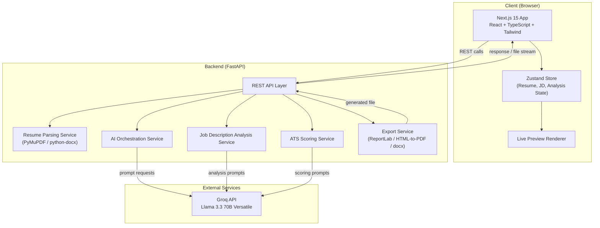
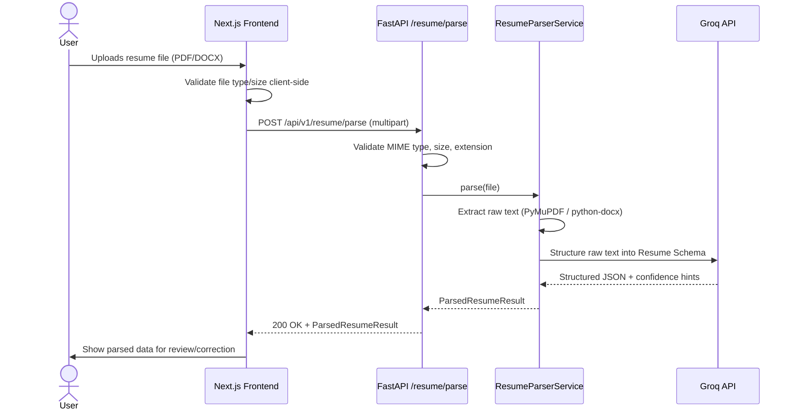
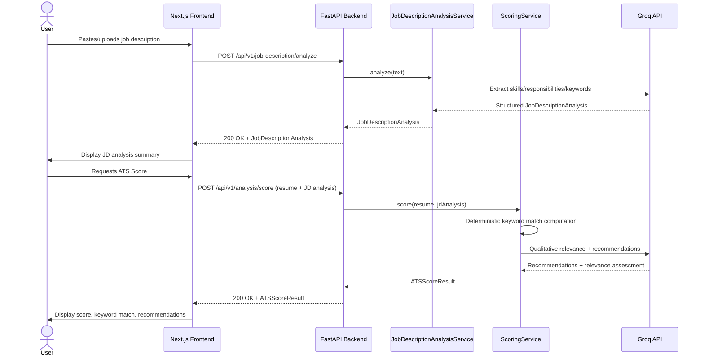
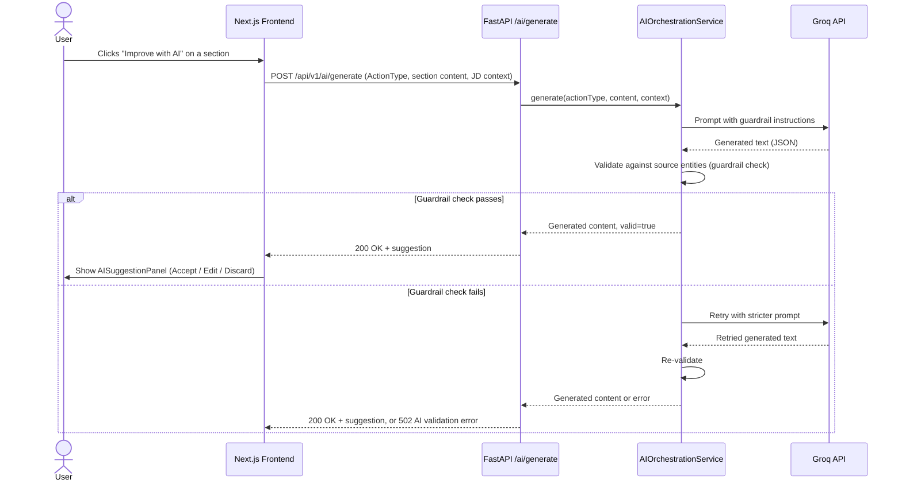
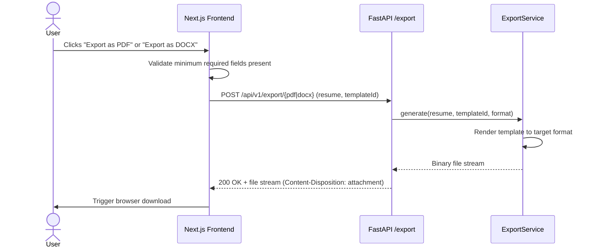

# Technical Requirements Document (TRD)
## AI Resume Generator & ATS Resume Optimizer

**Document Version:** 1.0
**Status:** Draft for Review
**Document Owner:** Engineering
**Prepared For:** Frontend Engineering, Backend Engineering, AI/Prompt Engineering, and Autonomous Coding Agents (Kilo Code / GLM 5.1)
**Companion Documents:** PRD (01), Application Flow Document (03), Data Schema Document (04), Security & Data Protection Document (05)

---

## Table of Contents

1. Scope and Objectives
2. Architecture Principles
3. System Architecture Overview
4. High-Level Architecture
5. Low-Level Architecture
6. Frontend Architecture
7. Backend Architecture
8. AI Architecture
9. API Architecture and Contracts
10. Folder Structure
11. Component Structure
12. State Management
13. Data Flow
14. Sequence Diagrams
15. Deployment Strategy
16. Performance Requirements
17. Error Handling Strategy
18. Logging Strategy
19. Scalability Considerations
20. Coding Standards and Naming Conventions
21. Environment Variables
22. Risks and Mitigations
23. Revision History

---

## 1. Scope and Objectives

This document defines the complete technical architecture required to implement the product described in the PRD. It is written so that an autonomous coding agent (Kilo Code running GLM 5.1 inside VS Code) can generate the application's frontend, backend, and AI-integration code without needing clarification on architecture, API contracts, folder layout, or coding conventions. Every architectural decision stated here is treated as a firm constraint unless explicitly marked optional.

The objective is a decoupled, two-tier web application: a Next.js 15 frontend responsible for all UI, client-side state, and live preview rendering, and a FastAPI backend responsible for resume parsing, job description analysis, AI orchestration via the Groq API, scoring logic, and document export generation.

---

## 2. Architecture Principles

The system follows Clean Architecture, meaning business logic (resume analysis, scoring, prompt orchestration) is isolated from framework-specific code (FastAPI route handlers, Next.js page components) behind clear interfaces, so that either layer could theoretically be replaced without rewriting core logic. The system follows the SOLID principles throughout backend service design: each service class has a single responsibility (for example, a `ResumeParserService` only parses, a `ScoringService` only scores), services depend on abstractions (interfaces/protocols) rather than concrete implementations where multiple implementations are plausible (for example, swappable AI providers), and classes are open for extension but closed for modification.

The system follows DRY by centralizing shared logic (resume schema validation, prompt templates, error formatting) in single, reusable locations rather than duplicating it across routes or components. The system follows KISS by preferring straightforward, readable implementations over premature abstraction, particularly given the no-login, session-scoped nature of the product, which removes the need for complex multi-tenant data architecture. The system enforces Separation of Concerns across three layers in the backend: API layer (route handlers, request/response models), Service layer (business logic), and Integration layer (Groq API client, file parsing libraries, PDF/DOCX generation). The frontend is organized around a feature-based folder structure rather than a purely type-based one (avoiding a flat dump of all components in a single folder), described in detail in Section 10.

All code is written with type safety as a hard requirement: TypeScript in strict mode on the frontend, and Python type hints validated through Pydantic models on the backend. Reusable services and components are preferred over one-off, page-specific logic wherever the same capability is needed in more than one place (for example, the AI rewriting action used across summary, experience, and project sections shares one underlying service and one underlying UI component, parameterized by section type).

---

## 3. System Architecture Overview

The application is a client-server web application with no persistent user accounts. The Next.js frontend is a single-page-application-style experience (using the Next.js App Router) that manages all in-session resume state on the client via Zustand, sending discrete, stateless requests to the FastAPI backend for parsing, analysis, AI generation, and export. The backend does not maintain server-side session state between requests beyond what is required to process a single request (for example, holding an uploaded file in memory or temporary storage only for the duration of parsing, per the Security & Data Protection Document). The backend integrates with the Groq API as the sole AI provider for this phase.



---

## 4. High-Level Architecture

At a high level, the system consists of four logical planes. The **Presentation Plane** is the Next.js frontend, covering all screens defined in the Application Flow Document, the live preview engine, and template rendering. The **API Plane** is the FastAPI application exposing versioned REST endpoints (`/api/v1/...`) that the frontend calls; this plane is responsible for request validation (via Pydantic models), authentication-free request handling, and orchestrating calls into the service plane. The **Service Plane** contains the core business logic: resume parsing, job description analysis, AI orchestration and prompt management, ATS scoring, and document export generation. The **Integration Plane** wraps all external dependencies: the Groq API client, PDF/DOCX parsing libraries (PyMuPDF, python-docx), and PDF/DOCX generation libraries (ReportLab or HTML-to-PDF renderer, and a DOCX writer library).

This layering ensures that, for example, if the AI provider were ever changed, only the Integration Plane's Groq client wrapper needs modification, not the Service Plane's `AIOrchestrationService` interface or any API route.

---

## 5. Low-Level Architecture

### 5.1 Backend Service Breakdown

`ResumeParserService` accepts an uploaded file (PDF or DOCX), extracts raw text and structural hints (headings, bullet markers, whitespace patterns) using PyMuPDF for PDF and python-docx for DOCX, then passes the extracted raw text through an AI-assisted structuring step (a Groq prompt instructed to classify content into the Resume Schema defined in the Data Schema Document) and returns a structured `ParsedResumeResult` including a per-section confidence indicator.

`JobDescriptionAnalysisService` accepts raw job description text (from paste or from an uploaded/parsed file) and returns a structured `JobDescriptionAnalysis` object containing required skills, preferred skills, responsibilities, and a ranked keyword list, generated via a dedicated Groq prompt template.

`AIOrchestrationService` is the single entry point for all AI text-generation actions (summary generation/rewrite, experience bullet rewrite, project description rewrite, achievement phrasing suggestions). It is parameterized by an `ActionType` enum and a context payload (the relevant resume section plus, optionally, the job description analysis), and it enforces the truthfulness guardrail described in Section 8 before returning generated text to the caller.

`ScoringService` accepts a structured resume and a structured job description analysis and returns an `ATSScoreResult` containing the overall numeric score, category sub-scores (keyword coverage, skills alignment, experience relevance, formatting compatibility), matched keywords, missing required keywords, missing preferred keywords, and an ordered list of specific recommendations. Scoring combines deterministic keyword-matching logic (computed directly in Python, not via AI, for the keyword match component) with an AI-generated qualitative assessment (for relevance and recommendation generation), to ensure the numeric keyword match portion is reproducible and not subject to model non-determinism.

`ExportService` accepts a finalized structured resume plus a selected template identifier and produces either a PDF (via ReportLab or an HTML-to-PDF rendering pipeline driven by the same template markup used for live preview) or a DOCX (via a DOCX-generation library that writes structured paragraphs/headings, avoiding embedded images or text boxes for core content, preserving ATS parseability).

### 5.2 Frontend Module Breakdown

The frontend is organized into feature modules: `resume-builder` (all form-based creation/editing screens and components), `resume-upload` (upload UI, parsing-in-progress UI, parsed-result review UI), `job-description` (paste/upload UI and analysis display), `ai-analysis` (ATS score display, keyword match display, recommendations list), `template-preview` (template selector and live preview renderer), and `export` (PDF/DOCX export triggers and download handling). Each feature module contains its own components, hooks, and API-client functions, with shared primitives (buttons, inputs, cards, modals) in a common `components/ui` directory, consistent with the folder structure in Section 10.

---

## 6. Frontend Architecture

The frontend is built on Next.js 15 using the App Router, React, and TypeScript in strict mode. Styling uses Tailwind CSS utility classes exclusively, with a shared design token configuration (colors, spacing, typography) centralized in the Tailwind config rather than scattered inline values, per the Frontend Design skill guidance used at implementation time. Form handling across all structured-data entry screens (resume builder fields, job description paste field) uses React Hook Form, with all schema validation defined using Zod schemas that mirror the backend Pydantic models field-for-field, so that client-side and server-side validation rules never diverge. Application state that must persist across screens within a session (the in-progress resume object, the job description analysis result, the current ATS score/recommendations, the selected template) is managed in Zustand, structured as a small number of focused stores (`useResumeStore`, `useJobDescriptionStore`, `useAnalysisStore`, `useTemplateStore`) rather than a single monolithic global store, so that components only subscribe to the state slices they actually need.

The live preview is implemented as a pure, side-effect-free rendering function that takes the current resume state and selected template and produces the visual layout shown to the user; this same rendering logic (or an equivalent HTML/CSS representation of it) is what the backend's HTML-to-PDF export path consumes, ensuring the exported PDF visually matches what the user saw in preview. All network calls to the backend are centralized in a typed API client module (one function per endpoint, using the OpenAPI-generated or manually maintained TypeScript types matching backend Pydantic response models), never called ad hoc from inside components.

---

## 7. Backend Architecture

The backend is built on FastAPI with Python, structured around the layered Service Plane described in Section 5. All request and response bodies are defined as Pydantic models, which serve simultaneously as runtime validation, as the source of truth for the Data Schema Document's JSON models, and as the basis for auto-generated OpenAPI documentation that the frontend's typed API client is kept in sync with. Routes are grouped into routers by feature area (`resume.py`, `job_description.py`, `analysis.py`, `export.py`), each exposing endpoints under a common `/api/v1` prefix. Business logic never lives inside route handler functions; handlers are thin, responsible only for request parsing (handled automatically by FastAPI/Pydantic), invoking the appropriate service method, and shaping the response, consistent with Separation of Concerns.

File uploads (resume files, job description files) are streamed and validated (MIME type, size limit, extension) at the API boundary before being passed to the parsing services, per the rules detailed in the Security & Data Protection Document. The backend holds no persistent database as a hard requirement; SQLite is listed as optional infrastructure and, if used, is scoped to ephemeral/operational data only (for example, short-lived rate-limit counters), never to storing user resume or job description content beyond the active request/session lifecycle, consistent with the no-login, no-persistent-storage product design.

---

## 8. AI Architecture

All AI capability in this product is provided through the Groq API using the Llama 3.3 70B Versatile model (or the latest compatible production model available through Groq at deployment time). The `AIOrchestrationService` is the sole component permitted to call the Groq API directly; no other backend service or frontend code makes direct AI provider calls, ensuring prompt logic, guardrails, and error handling are centralized in one place.

Each AI capability (resume structuring, job description analysis, summary generation, bullet rewriting, achievement phrasing, recommendation generation) is implemented as a distinct, versioned prompt template stored in a dedicated `prompts/` module, rather than as inline strings scattered through service code. Every generation-oriented prompt template includes an explicit system-level instruction that the model must not introduce any employer, job title, skill, date, certification, degree, or quantified metric that was not present in the provided source content, and that the model's task is limited to rephrasing, restructuring, condensing, and improving clarity/professionalism of existing content. Prompts additionally instruct the model to return structured JSON output matching a specified schema wherever the consuming code needs to parse specific fields (for example, the job description analysis and scoring prompts), which the backend validates against the corresponding Pydantic model before returning it to the frontend; a response that fails schema validation is treated as an AI error and triggers the retry/fallback path described in Section 17, not a silent pass-through of malformed data.

A lightweight post-generation validation step compares AI-rewritten text against the original source content's key entities (company names, skill terms, dates extracted from the original) to catch obvious guardrail violations before the content is returned to the user; any detected violation causes the service to discard the AI output and either retry with a stricter prompt or surface an error rather than deliver unverified content.

---

## 9. API Architecture and Contracts

The API is a versioned REST API under the `/api/v1` prefix, using standard HTTP verbs and status codes, and returning JSON for all endpoints except the export endpoints, which return a binary file stream with appropriate `Content-Type` and `Content-Disposition` headers. Representative endpoint groups are listed below; complete request/response schemas are defined in the Data Schema Document.

`POST /api/v1/resume/parse` accepts a multipart file upload (PDF or DOCX) and returns a `ParsedResumeResult` containing the structured resume data and per-section confidence indicators.

`POST /api/v1/resume/validate` accepts a structured resume payload and returns validation results (missing required fields, per the business rules in the PRD) without performing any AI operation.

`POST /api/v1/job-description/analyze` accepts either raw text or an uploaded file and returns a `JobDescriptionAnalysis` object.

`POST /api/v1/ai/generate` accepts an `ActionType`, the relevant resume section content, and optionally the current job description analysis, and returns AI-generated replacement content for that section along with a flag indicating whether guardrail validation passed cleanly or required a retry.

`POST /api/v1/analysis/score` accepts a structured resume and a `JobDescriptionAnalysis` and returns an `ATSScoreResult`.

`POST /api/v1/export/pdf` accepts a structured resume and a template identifier and returns a PDF file stream.

`POST /api/v1/export/docx` accepts a structured resume and a template identifier and returns a DOCX file stream.

All endpoints return a consistent error envelope on failure (`{ "error": { "code": string, "message": string, "details": object|null } }`), with HTTP status codes used semantically (400 for validation errors, 413 for oversized uploads, 415 for unsupported file types, 422 for schema validation failures, 502/504 for upstream Groq API failures/timeouts, 500 for unhandled server errors), so the frontend can render targeted, specific error messaging rather than a single generic failure state.

---

## 10. Folder Structure

```text
project-root/
├── frontend/
│   ├── app/
│   │   ├── (marketing)/
│   │   │   └── page.tsx                 # Landing page
│   │   ├── build/
│   │   │   └── page.tsx                 # Resume builder entry
│   │   ├── upload/
│   │   │   └── page.tsx                 # Resume upload entry
│   │   ├── job-description/
│   │   │   └── page.tsx
│   │   ├── analysis/
│   │   │   └── page.tsx
│   │   ├── preview/
│   │   │   └── page.tsx
│   │   ├── layout.tsx
│   │   └── globals.css
│   ├── features/
│   │   ├── resume-builder/
│   │   │   ├── components/
│   │   │   ├── hooks/
│   │   │   └── api.ts
│   │   ├── resume-upload/
│   │   │   ├── components/
│   │   │   ├── hooks/
│   │   │   └── api.ts
│   │   ├── job-description/
│   │   │   ├── components/
│   │   │   ├── hooks/
│   │   │   └── api.ts
│   │   ├── ai-analysis/
│   │   │   ├── components/
│   │   │   ├── hooks/
│   │   │   └── api.ts
│   │   ├── template-preview/
│   │   │   ├── components/
│   │   │   ├── templates/
│   │   │   └── hooks/
│   │   └── export/
│   │       ├── components/
│   │       └── api.ts
│   ├── components/
│   │   └── ui/                          # Shared primitives (Button, Input, Card, Modal)
│   ├── stores/
│   │   ├── useResumeStore.ts
│   │   ├── useJobDescriptionStore.ts
│   │   ├── useAnalysisStore.ts
│   │   └── useTemplateStore.ts
│   ├── lib/
│   │   ├── api-client.ts
│   │   ├── schemas/                     # Zod schemas mirroring backend Pydantic models
│   │   └── utils/
│   ├── types/
│   └── public/
│
├── backend/
│   ├── app/
│   │   ├── main.py
│   │   ├── api/
│   │   │   └── v1/
│   │   │       ├── resume.py
│   │   │       ├── job_description.py
│   │   │       ├── analysis.py
│   │   │       ├── ai.py
│   │   │       └── export.py
│   │   ├── services/
│   │   │   ├── resume_parser_service.py
│   │   │   ├── job_description_service.py
│   │   │   ├── ai_orchestration_service.py
│   │   │   ├── scoring_service.py
│   │   │   └── export_service.py
│   │   ├── integrations/
│   │   │   ├── groq_client.py
│   │   │   ├── pdf_parser.py            # PyMuPDF wrapper
│   │   │   ├── docx_parser.py           # python-docx wrapper
│   │   │   ├── pdf_generator.py         # ReportLab / HTML-to-PDF wrapper
│   │   │   └── docx_generator.py
│   │   ├── prompts/
│   │   │   ├── resume_structuring_prompt.py
│   │   │   ├── job_description_prompt.py
│   │   │   ├── generation_prompts.py
│   │   │   └── scoring_prompt.py
│   │   ├── models/
│   │   │   ├── resume.py                # Pydantic models
│   │   │   ├── job_description.py
│   │   │   ├── analysis.py
│   │   │   └── errors.py
│   │   ├── core/
│   │   │   ├── config.py                # Environment variable loading
│   │   │   ├── logging.py
│   │   │   └── exceptions.py
│   │   └── utils/
│   ├── tests/
│   └── requirements.txt
│
└── docs/                                # This documentation set
```

---

## 11. Component Structure

Frontend components follow a three-tier composition pattern. **Primitive components** (in `components/ui`) are stateless, style-only building blocks such as `Button`, `TextInput`, `TextArea`, `Card`, `Modal`, `ProgressIndicator`, and `Badge`, with no feature-specific logic. **Composite components** (inside each `features/*/components` directory) combine primitives into feature-specific units, such as `ExperienceEntryForm`, `ResumeUploadDropzone`, `KeywordMatchList`, `ATSScoreGauge`, and `TemplateSelectorCard`. **Page-level components** (in `app/*/page.tsx`) compose composite components into full screens and are responsible for wiring in the relevant Zustand store slices and triggering the relevant API calls via feature-level hooks, but contain minimal logic of their own. Every composite and page-level component that touches AI-generated content includes a consistent `AISuggestionPanel` pattern (used for summary rewrite, bullet rewrite, and achievement suggestions alike), so that the accept/edit/discard interaction is visually and behaviorally identical everywhere it appears.

---

## 12. State Management

Zustand is used for all cross-screen application state. `useResumeStore` holds the full structured resume object (matching the Resume Schema) plus a `dirty` flag and per-section validation state; all form components read from and write to this store rather than maintaining parallel local copies of resume data, so the live preview and the export flow always operate on a single source of truth. `useJobDescriptionStore` holds the raw job description text/source and the resulting `JobDescriptionAnalysis` once analysis has completed. `useAnalysisStore` holds the current `ATSScoreResult` (score, matched/missing keywords, recommendations) and tracks whether it is stale relative to the latest resume/job-description edits, so the UI can prompt the user to re-run analysis after making changes. `useTemplateStore` holds the currently selected template identifier and any template-specific display options. Local component state (via React's `useState`) is reserved for purely transient UI concerns (an input's focus state, a dropdown's open/closed state) and never used to hold data that other components or the export flow need to read.

---

## 13. Data Flow

The canonical data flow for a full user session is as follows: the user produces a structured resume object either via the resume-builder form (writing directly into `useResumeStore`) or via the upload-and-parse flow (backend returns a `ParsedResumeResult`, which the frontend loads into `useResumeStore` after user review); the user optionally provides a job description, which the backend analyzes into a `JobDescriptionAnalysis` stored in `useJobDescriptionStore`; the user triggers scoring, which sends the current `useResumeStore` and `useJobDescriptionStore` contents to the backend's scoring endpoint and stores the result in `useAnalysisStore`; the user optionally triggers AI rewriting on specific sections, each of which sends the relevant section content (plus job description context, if available) to the AI generation endpoint and, upon user acceptance, writes the returned content back into `useResumeStore`; the user selects a template (`useTemplateStore`), which drives the live preview renderer reading from `useResumeStore`; finally, the user triggers export, sending the final `useResumeStore` contents and selected template to the export endpoint, which streams back a PDF or DOCX file for download. No step in this flow requires server-side persistence of the resume or job description beyond the lifecycle of the individual request being processed.

---

## 14. Sequence Diagrams

### 14.1 Resume Upload and Parsing



### 14.2 Job Description Analysis and ATS Scoring



### 14.3 AI-Assisted Section Rewrite with Guardrail Validation



### 14.4 Export Flow (PDF/DOCX)



---

## 15. Deployment Strategy

The frontend (Next.js 15) is deployed as a standard Node.js-compatible web application, suitable for platforms supporting server-side rendering and API routes (for example, Vercel or any Node-capable container host); static assets are served via the platform's CDN layer where available. The backend (FastAPI) is deployed as a standalone ASGI application (served via Uvicorn/Gunicorn) behind a reverse proxy, packaged as a container image for portability across cloud providers. Both services read all provider credentials and configuration exclusively from environment variables (Section 21); no secrets are committed to source control. The frontend and backend are deployed as independently scalable services, communicating over HTTPS, with CORS configured on the backend to allow only the known frontend origin(s), per the Security & Data Protection Document. Deployment environments are separated into at least `development`, `staging`, and `production`, each with its own environment variable set and, where applicable, its own Groq API key.

---

## 16. Performance

The frontend shall achieve interactive readiness on the landing and builder pages within standard modern web performance budgets, using Next.js's built-in code-splitting so that template-rendering and export-related code is not loaded until needed. All AI-dependent backend operations (parsing structuring step, job description analysis, section rewrite, scoring) shall be implemented as asynchronous FastAPI endpoints to avoid blocking the event loop during upstream Groq API calls. Long-running operations (resume parsing with AI structuring, full scoring) shall be paired on the frontend with explicit loading states (per the Application Flow Document) rather than allowing the UI to appear unresponsive. File parsing operations shall enforce a maximum processing time; requests exceeding this threshold shall return a timeout error rather than hanging indefinitely, allowing the frontend to present a clear retry option.

---

## 17. Error Handling

The backend uses a centralized exception-handling layer (FastAPI exception handlers) that converts all known exception types (validation errors, unsupported file type, oversized upload, Groq API timeout/rate-limit/error, guardrail validation failure, internal server error) into the consistent error envelope defined in Section 9, ensuring the frontend never needs to special-case error parsing per endpoint. Recoverable AI errors (transient Groq API timeouts or rate limits) are retried a bounded number of times with backoff inside the relevant service before surfacing an error to the caller. Guardrail validation failures on AI-generated content are never silently passed through to the user; the service either retries generation with a stricter prompt or returns an explicit error indicating the AI suggestion could not be validated, allowing the frontend to inform the user and offer to proceed without that suggestion. On the frontend, every feature module's API-calling hooks expose a consistent `{ data, error, isLoading }` shape, and every screen defined in the Application Flow Document has an explicit error-state UI (not just a loading and success state), consistent with the Application Flow Document's coverage of failure flows.

---

## 18. Logging

The backend logs are structured (JSON-formatted) and include a request correlation ID generated per incoming request, propagated through service-layer log statements, so that a single user action can be traced end to end across parsing, AI orchestration, and scoring services. Logs at the `INFO` level cover request entry/exit and major service operations (parse started/completed, AI generation started/completed, export generated); logs at the `WARNING` level cover recoverable issues (a guardrail retry, a low-confidence parse section); logs at the `ERROR` level cover unhandled exceptions and exhausted-retry AI failures. Consistent with the Security & Data Protection Document, logs never include the full raw content of a user's resume or job description (personal data), and instead log metadata only (file size, section counts, confidence scores, error types), to avoid inadvertent sensitive-data retention in log storage.

---

## 19. Scalability

Because the system holds no persistent server-side session state tied to a specific user (per the no-login design), the backend can scale horizontally behind a load balancer with no sticky-session requirement; any backend instance can serve any incoming request. The primary scalability constraint is Groq API throughput and rate limits; the `AIOrchestrationService` is designed to centralize all AI calls specifically so that a future rate-limiting, queuing, or caching layer (for example, caching job-description analysis results for identical input text within a short window) can be introduced at a single integration point without touching route handlers or frontend code. The export pipeline (PDF/DOCX generation) is CPU-bound rather than AI-bound and can be scaled independently of AI-dependent endpoints if usage patterns warrant separating these into distinct deployable services in the future.

---

## 20. Coding Standards and Naming Conventions

Frontend TypeScript code uses `PascalCase` for React components and their files (`ResumeBuilderForm.tsx`), `camelCase` for functions, variables, and hooks (`useResumeStore`, `formatExperienceDate`), and `SCREAMING_SNAKE_CASE` for module-level constants. Backend Python code follows PEP 8: `snake_case` for functions and variables, `PascalCase` for classes (`ResumeParserService`, `ATSScoreResult`), and `UPPER_SNAKE_CASE` for constants and environment variable names. Pydantic models and their corresponding TypeScript/Zod types share matching field names (using `snake_case` in Python/JSON payloads, translated consistently to `camelCase` at the frontend API-client boundary only, never inconsistently mixed within either language). All backend service methods are typed with explicit return type annotations; all frontend exported functions and components are typed with explicit prop/return interfaces, with `any` disallowed except in narrowly justified, commented exceptions. Every backend API route file, service file, and integration file begins with a module-level docstring describing its single responsibility, reinforcing the Separation of Concerns principle for both human reviewers and AI coding agents reading the codebase.

---

## 21. Environment Variables

| Variable | Scope | Description |
|---|---|---|
| `GROQ_API_KEY` | Backend | API key for authenticating with the Groq API. Never exposed to the frontend. |
| `GROQ_MODEL_NAME` | Backend | Model identifier, defaulting to the Llama 3.3 70B Versatile production model (or latest compatible equivalent). |
| `BACKEND_CORS_ORIGINS` | Backend | Comma-separated list of allowed frontend origins for CORS. |
| `MAX_UPLOAD_SIZE_MB` | Backend | Maximum accepted upload size for resume/job description files. |
| `AI_REQUEST_TIMEOUT_SECONDS` | Backend | Timeout applied to outbound Groq API calls. |
| `AI_MAX_RETRIES` | Backend | Maximum retry attempts for recoverable AI errors and guardrail-failure retries. |
| `LOG_LEVEL` | Backend | Minimum log level emitted (e.g., INFO, WARNING). |
| `NEXT_PUBLIC_API_BASE_URL` | Frontend | Base URL of the backend API the frontend targets per environment. |
| `NODE_ENV` | Frontend | Standard Next.js environment flag (development/production). |

No secret value (API keys) is ever prefixed with `NEXT_PUBLIC_`, since any such variable is bundled into client-side JavaScript and would be publicly exposed; the Groq API key exists only in the backend environment.

---

## 22. Risks and Mitigations

The technical risk most central to this architecture is inconsistency between the frontend's live preview rendering and the backend's export rendering, which could cause an exported PDF/DOCX to visually differ from what the user approved; this is mitigated by driving both preview and PDF export from the same template markup/rendering approach described in Section 6. A second risk is AI response schema drift, where the Groq model returns JSON that does not conform to the expected structure; this is mitigated by strict Pydantic validation on every AI JSON response, with validation failures triggering the retry/error path in Section 17 rather than being passed through. A third risk is inconsistent Zod/Pydantic schema drift between frontend and backend as the product evolves; this is mitigated by treating the backend Pydantic models as the canonical source of truth (per Section 9) and generating or manually synchronizing frontend types/schemas from them as part of the standard development workflow.

---

## 23. Revision History

| Version | Date | Author | Description |
|---|---|---|---|
| 1.0 | Initial Draft | Engineering | Initial creation of the Technical Requirements Document covering architecture, API contracts, folder structure, data flow, sequence diagrams, and coding standards. |

---

*End of Technical Requirements Document. Proceeding to the Application Flow Document.*
