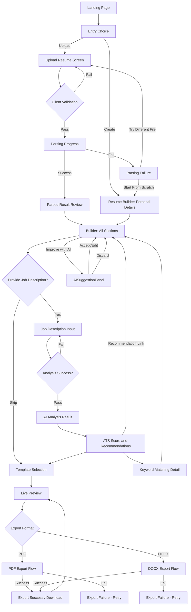

# Application Flow Document
## AI Resume Generator & ATS Resume Optimizer

**Document Version:** 1.0
**Status:** Draft for Review
**Document Owner:** UX/UI Design & Engineering
**Companion Documents:** PRD (01), TRD (02), Data Schema Document (04), Security & Data Protection Document (05)

---

## Table of Contents

1. Purpose and Scope
2. Screen Inventory
3. Landing Page
4. Entry Choice: Create vs Upload
5. Create Resume (Guided Form Flow)
6. Upload Resume Flow
7. Resume Parsing (Processing State)
8. Manual Editing Flow
9. Job Description Input Flow
10. AI Analysis Flow
11. Resume Redesign / AI Rewrite Flow
12. Keyword Matching Screen
13. ATS Optimization / Score Screen
14. Template Selection Screen
15. Live Preview
16. PDF Export Flow
17. DOCX Export Flow
18. Success Flow (End-to-End)
19. Failure Flows
20. Loading States
21. Validation Rules by Screen
22. Edge Cases
23. Alternative User Paths
24. Master Flowchart
25. Revision History

---

## 1. Purpose and Scope

This document describes every screen in the application, every interaction available on that screen, and every transition between screens, including success paths, failure paths, loading states, and validation behavior. It is the behavioral specification that complements the TRD's structural specification and the Data Schema Document's data-level specification. Every screen referenced here corresponds to a route defined in the TRD's folder structure (Section 10 of the TRD).

---

## 2. Screen Inventory

The application consists of the following screens: Landing Page; Entry Choice screen (Create vs Upload); Resume Builder screens (one per section: Personal Details, Summary, Experience, Education, Projects, Skills, Certifications, Achievements, References); Resume Upload screen; Parsing Progress screen; Parsed Result Review screen; Job Description Input screen; Job Description Analysis Result screen; AI Rewrite interaction (an in-context panel available from multiple screens rather than a standalone screen); ATS Score & Recommendations screen; Keyword Match Detail screen; Template Selection screen; Live Preview screen (often shown side-by-side with the builder, per the TRD's live preview architecture); Export screen/modal (PDF/DOCX choice); and a generic Error screen/state pattern used across all of the above.

---

## 3. Landing Page

**Purpose.** Introduce the product, communicate the no-login value proposition, and route the user into the core flow.

**Elements.** A primary headline communicating the core value ("Build and optimize an ATS-ready resume in minutes — no sign-up required"), a short supporting description, a primary call-to-action button ("Get Started"), and secondary explanatory content (how it works, in three or four steps: build/upload, paste a job description, get your score, export).

**Interactions.** Clicking "Get Started" (or equivalent primary CTA) transitions the user to the Entry Choice screen. No form fields exist on this screen, so no validation applies.

**Transitions.** Landing Page → Entry Choice screen.

---

## 4. Entry Choice: Create vs Upload

**Purpose.** Let the user choose whether they are starting from nothing (Create) or already have a resume (Upload).

**Elements.** Two clearly differentiated options presented as cards or large buttons: "Create a new resume" and "Upload an existing resume," each with a one-line description of what happens next.

**Interactions.** Selecting "Create a new resume" routes to the Resume Builder flow (Section 5) with an empty resume object initialized in `useResumeStore`. Selecting "Upload an existing resume" routes to the Upload screen (Section 6).

**Transitions.** Entry Choice → Resume Builder (Personal Details) **or** Entry Choice → Upload screen.

---

## 5. Create Resume (Guided Form Flow)

**Purpose.** Collect complete, structured resume data through a sequence of section-specific forms.

**Flow Structure.** The builder proceeds through sections in a fixed recommended order — Personal Details, Professional Summary, Work Experience, Education, Projects, Skills, Certifications, Achievements, References — but the user is not forced to complete them strictly in order; a persistent section navigator (sidebar or stepper) allows jumping directly to any section at any time, since some users (per Persona 4, Divya) prefer to work non-linearly.

**Personal Details Section.** Fields include full name, professional title/headline, email, phone, location (city/region), and optional links (LinkedIn, portfolio, GitHub). This section is required in full for export eligibility per the PRD's business rules.

**Professional Summary Section.** A multi-line text field for a 2–4 sentence professional summary, with an "Improve with AI" action available once at least minimal content exists (the AI cannot generate a summary from nothing; if the field is empty, the AI action is disabled with an explanatory tooltip directing the user to first fill in at least their target role/title and a sentence or two, or to complete the Experience section first, since the summary generator can draw on entered experience).

**Work Experience Section.** A repeatable list of entries, each with company name, job title, start date, end date (or "Present"), location, and a multi-line bullet-point description field. Each entry supports an "Improve with AI" action scoped to that entry's bullets. Entries can be reordered via drag-and-drop or up/down controls and can be duplicated (useful when a user held multiple similar roles) or deleted.

**Education Section.** A repeatable list of entries: institution name, degree/field of study, start date, end date (or expected date), and optional details (GPA, honors, relevant coursework).

**Projects Section.** A repeatable list of entries: project name, optional link, timeframe, and a multi-line description field, with the same "Improve with AI" action pattern as Experience.

**Skills Section.** A tag-style input allowing the user to add individual skills; skills can optionally be grouped into categories (for example, "Technical Skills," "Tools," "Soft Skills") if the user chooses to categorize them.

**Certifications Section.** A repeatable list of entries: certification name, issuing organization, and date obtained (and optional expiration date).

**Achievements Section.** A repeatable list of short achievement statements, each with an available "Suggest measurable phrasing" AI action that prompts the user to confirm or supply a metric rather than inventing one (per the TRD's guardrail design).

**References Section.** Optional; either a repeatable list of reference contacts (name, relationship, contact info) or a simple toggle for "References available upon request," reflecting common resume conventions.

**Interactions.** Every field auto-saves into `useResumeStore` on change (no explicit "Save" button required within the builder, consistent with the live, in-session state model). Each section displays a completion indicator (complete / partial / empty) in the section navigator.

**Transitions.** From any point in the builder, the user can proceed to Job Description Input (Section 9), jump to Template Selection (Section 14), or jump to Live Preview (Section 15); the builder does not force a single linear exit point.

---

## 6. Upload Resume Flow

**Purpose.** Allow the user to upload an existing resume file for automatic parsing.

**Elements.** A drag-and-drop dropzone with a fallback "Browse files" button, file-type/size constraints clearly displayed (PDF or DOCX, up to the configured maximum size), and, once a file is selected, a file preview chip (filename, size, a "Remove" control to pick a different file before submitting).

**Interactions.** On file selection, the frontend performs client-side validation (extension and size) before enabling the "Upload & Parse" button. Clicking "Upload & Parse" submits the file to the backend parsing endpoint and transitions to the Parsing Progress screen (Section 7).

**Transitions.** Upload screen → Parsing Progress screen (on submit) **or** stays on Upload screen with an inline validation message (on client-side validation failure, before any network call is made).

---

## 7. Resume Parsing (Processing State)

**Purpose.** Communicate that the uploaded file is being processed, since parsing (including the AI structuring step) is not instantaneous.

**Elements.** A progress indicator with staged messaging (for example, "Reading your file…" → "Identifying sections…" → "Structuring your experience…") to keep the user informed during a multi-step backend operation, consistent with the TRD's guidance to always pair long-running AI operations with clear loading states.

**Interactions.** No user interaction is expected other than an optional "Cancel" control, which, if selected, aborts the in-flight request and returns the user to the Upload screen.

**Transitions.** On success → Parsed Result Review screen (Section 8, functioning as the manual editing entry point for uploaded resumes). On failure → Failure Flow (Section 19), specifically the Parsing Failure sub-flow.

---

## 8. Manual Editing Flow (Parsed Result Review)

**Purpose.** Let the user review, correct, and complete the structured data produced by parsing before proceeding.

**Elements.** The same section-by-section form UI used in the Create flow (Section 5), pre-populated with parsed values, plus a confidence indicator per section (High / Needs Review / Not Found) so the user knows exactly where to focus attention; sections marked "Needs Review" or "Not Found" are visually flagged (for example, an amber or red badge) and, where "Not Found," the section is presented empty with a prompt to fill it in manually.

**Interactions.** Identical editing interactions to the Create flow (add/edit/reorder/delete entries, per-section AI improve actions). The user can accept the parsed data as-is for any high-confidence section or edit any field freely.

**Transitions.** Functions as a shared hub with the Create flow from this point forward — both entry paths converge into the same builder/editing experience, and the remaining flow (Job Description Input, AI Analysis, Template Selection, Preview, Export) is identical regardless of whether the user started by creating or uploading.

---

## 9. Job Description Input Flow

**Purpose.** Capture the target job description that resume content will be analyzed and optimized against.

**Elements.** A tabbed or toggled input area offering "Paste text" (a large multi-line text field) and "Upload file" (a dropzone accepting PDF, DOCX, or plain text), plus an optional field for the target job title and company name (used for display/labeling purposes, not required for analysis to function).

**Interactions.** Submitting pasted text or an uploaded file triggers the backend job description analysis endpoint and transitions to a brief loading state, then to the Job Description Analysis Result screen. This step is explicitly optional in the overall flow — a user can proceed directly from the builder to Template Selection/Preview/Export without ever providing a job description, in which case AI Analysis, Keyword Matching, and ATS Scoring screens are simply unavailable/hidden, consistent with the PRD's business rule that scoring requires both resume and job description to be present.

**Transitions.** Job Description Input → (loading) → Job Description Analysis Result screen (Section 10) **or** Failure Flow on error.

---

## 10. AI Analysis Flow

**Purpose.** Present the structured result of job description analysis and lead the user toward scoring.

**Elements.** A summary display of the extracted required skills, preferred skills, and key responsibilities, along with a clear call-to-action to run ATS scoring now that both resume and job description data are available.

**Interactions.** Clicking "Analyze My Resume Against This Job" triggers the scoring endpoint and transitions to a loading state, then to the ATS Score & Recommendations screen (Section 13).

**Transitions.** AI Analysis Result → (loading) → ATS Score & Recommendations screen.

---

## 11. Resume Redesign / AI Rewrite Flow

**Purpose.** Provide a consistent, reusable interaction pattern for AI-assisted rewriting, available in-context from the Professional Summary, Work Experience, Project, and Achievement sections of the builder (per the TRD's `AISuggestionPanel` component).

**Elements.** An "Improve with AI" button adjacent to the relevant field/entry; upon activation, an `AISuggestionPanel` appears showing a loading state, then the AI-generated alternative text alongside (or below) the original, with three explicit actions: **Accept** (replaces the field content with the AI suggestion), **Edit** (loads the AI suggestion into the field as editable starting text, allowing the user to further adjust it manually before it becomes final), and **Discard** (closes the panel, leaving the original content untouched).

**Interactions.** If a job description has been analyzed, the rewrite action is automatically informed by that context (the panel indicates "Tailored to: [Job Title]" when applicable); if no job description is present, the rewrite still functions in a general "improve clarity and professionalism" mode. If guardrail validation fails on the backend (per the TRD's Section 17), the panel displays a specific message ("We couldn't generate a suggestion that preserved all your original details — please try again or edit manually") rather than silently failing.

**Transitions.** This flow does not navigate to a new screen; it is an in-place panel interaction that returns control to the same builder section on completion.

---

## 12. Keyword Matching Screen

**Purpose.** Give the user a granular, actionable breakdown of keyword alignment between their resume and the job description.

**Elements.** Three clearly separated lists: **Matched Keywords** (terms present in both), **Missing Required Keywords** (terms marked required in the job description but absent from the resume), and **Missing Preferred Keywords** (terms marked preferred/nice-to-have but absent). Each missing keyword includes a short contextual note where available (for example, which responsibility or requirement it came from) and a "Where might this apply?" hint pointing the user to the most relevant resume section to consider updating, without auto-inserting the keyword.

**Interactions.** The user can click through from a missing keyword directly to the relevant builder section to manually consider incorporating it (if genuinely applicable to their real experience), reinforcing the truthfulness guardrail — the system never adds the keyword for them.

**Transitions.** Reachable from the ATS Score screen (Section 13) via a "View Keyword Details" action; returns to the ATS Score screen or navigates into the builder.

---

## 13. ATS Optimization / Score Screen

**Purpose.** Present the overall ATS compatibility score and prioritized recommendations.

**Elements.** A prominent numeric/visual score display (for example, a gauge or percentage), sub-scores by category (keyword coverage, skills alignment, experience relevance, formatting compatibility, per the TRD's `ATSScoreResult`), and an ordered list of specific recommendations, each phrased as a concrete action rather than generic advice. Explicit framing text clarifies that the score is an estimate/guidance tool, not a guarantee of any specific ATS platform's behavior, per the PRD's risk mitigation for ATS Scoring Credibility.

**Interactions.** A "Re-analyze" action is available and becomes prominent whenever the resume or job description has changed since the score was last computed (per the TRD's staleness tracking in `useAnalysisStore`). A "View Keyword Details" action routes to the Keyword Matching screen. Recommendations may link directly into the relevant builder section, similar to the keyword-click-through behavior.

**Transitions.** ATS Score screen → Keyword Matching screen, **or** → back into the Builder (via a recommendation link), **or** → Template Selection screen, once the user is satisfied with their score.

---

## 14. Template Selection Screen

**Purpose.** Let the user choose the visual template for their resume.

**Elements.** A gallery of template thumbnails, each with a short label (for example, "Modern," "Classic," "Compact"), and a note on suitability where relevant (for example, "ATS-safe: single column, no graphics").

**Interactions.** Selecting a template updates `useTemplateStore` and immediately reflects in the Live Preview.

**Transitions.** Template Selection → Live Preview screen (Section 15), typically shown together rather than as a strict linear step.

---

## 15. Live Preview

**Purpose.** Show an accurate, real-time visual representation of the final resume as the user edits content or changes templates.

**Elements.** A rendered resume matching the selected template, updating on every relevant state change with no manual refresh required, per the TRD's live preview architecture. A zoom/scroll control for reviewing longer resumes.

**Interactions.** The preview is read-only with respect to content editing (edits happen in the builder, not directly in the preview pane, for this phase); the preview surfaces an "Export" call-to-action once minimum required fields are present.

**Transitions.** Live Preview → Export Flow (Section 16/17).

---

## 16. PDF Export Flow

**Purpose.** Produce and deliver a downloadable PDF version of the finished resume.

**Elements.** An export modal/screen confirming the selected template and offering the format choice (PDF highlighted here); a "Download PDF" button.

**Interactions.** Clicking "Download PDF" triggers client-side validation of minimum required fields (per the PRD's business rules); if validation fails, the user is shown which fields are missing and is not routed to the backend. If validation passes, the request is sent to the export endpoint, a brief loading state is shown, and on success the browser initiates a file download.

**Transitions.** On success → Success Flow (Section 18). On failure → Failure Flow (Export Failure sub-flow, Section 19).

---

## 17. DOCX Export Flow

**Purpose.** Produce and deliver a downloadable DOCX version of the finished resume.

**Elements and Interactions.** Identical structure to the PDF Export Flow (Section 16), targeting the DOCX export endpoint instead.

**Transitions.** Identical pattern to Section 16.

---

## 18. Success Flow (End-to-End)

The canonical success path is: Landing Page → Entry Choice → (Create or Upload+Parse+Review) → Job Description Input (optional) → AI Analysis (optional, only if job description provided) → ATS Score & Recommendations (optional) → AI-assisted rewrites applied as desired (optional, any number of times, in-place) → Template Selection → Live Preview → Export (PDF and/or DOCX). Upon a successful export, the user is shown a confirmation state (a success message and the option to export in the other format, or to make further edits and re-export), rather than being routed away from their in-progress resume, since a user may reasonably want both a PDF and a DOCX copy in the same session.

---

## 19. Failure Flows

**Upload Failure (Invalid File).** If a user attempts to upload a file of an unsupported type or exceeding the size limit, the Upload screen shows an inline, specific error message (naming the actual constraint violated) without navigating away; the user remains able to select a different file immediately.

**Parsing Failure.** If backend parsing fails entirely (corrupted file, unreadable content), the Parsing Progress screen transitions to an error state offering two clear recovery paths: "Try a different file" (returns to Upload screen) or "Start from scratch instead" (routes to the Create flow with an empty resume).

**Job Description Analysis Failure.** If analysis fails (upstream AI error, unreadable uploaded file), the Job Description Input screen shows an inline error with a "Retry" action; the user's already-entered text/file selection is preserved so they do not need to re-enter it.

**AI Rewrite Failure.** As described in Section 11, a failed or guardrail-rejected AI suggestion is shown as a specific message within the `AISuggestionPanel` itself, with a "Retry" option; the original field content is never lost or altered by a failed attempt.

**Scoring Failure.** If the scoring request fails, the ATS Score screen (or the transition into it) shows an error state with a "Retry" action; the user's resume and job description data remain fully intact in their respective stores.

**Export Failure.** If export generation fails on the backend, the export modal shows an error state with a "Retry" action; if the failure is due to missing required fields not caught by client-side validation (a defensive backend check), the specific missing fields are named.

**Network/Timeout Failure (Generic).** Any request that times out or fails due to connectivity is presented with a consistent, generic "Something went wrong — please try again" message paired with a "Retry" action, distinct from the more specific error states above, ensuring no screen ever leaves the user without a clear next action.

---

## 20. Loading States

Every asynchronous operation defined in this document has an explicit, named loading state rather than a generic spinner with no context, consistent with the TRD's performance requirements: file upload/parsing uses the staged messaging described in Section 7; job description analysis uses a single-stage "Analyzing job description…" indicator; AI section rewrites use a compact inline loading indicator within the `AISuggestionPanel`; ATS scoring uses a "Calculating your ATS score…" indicator; and export uses a "Preparing your [PDF/DOCX]…" indicator. All loading states disable the triggering action's control (preventing duplicate submissions) for the duration of the request.

---

## 21. Validation Rules by Screen

The Personal Details section requires full name at minimum before the resume is considered exportable, per the PRD's business rules; email/phone/location are recommended but not hard-blocking. The Upload screen enforces file type (PDF, DOCX) and maximum size client-side before submission, mirrored by a defensive server-side check per the TRD. The Job Description Input screen requires either non-empty pasted text or a successfully selected file before the "Analyze" action is enabled. The Export flow enforces the PRD's minimum-content rule (full name plus at least one of work experience, education, or projects) before allowing a request to reach the backend, with the specific missing requirement(s) named inline if the condition is not met.

---

## 22. Edge Cases

If a user uploads a resume that parses with zero recognizable sections (for example, a heavily image-based or non-standard-format PDF), the Parsed Result Review screen shows all sections as empty with "Not Found" indicators and a clear message suggesting the user either try a different file or proceed manually, rather than presenting a silently broken/empty builder with no explanation. If a user provides a job description that is too short or generic to extract meaningful requirements from, the Job Description Analysis Result screen indicates this explicitly ("We couldn't identify enough specific requirements in this job description — you can still get general resume improvement suggestions, but keyword matching may be limited") rather than presenting a misleadingly confident but empty analysis. If a user runs ATS scoring, then substantially edits their resume, then attempts to export without re-scoring, no export is blocked (scoring is not a hard prerequisite for export per the PRD), but the Live Preview/Export screen displays a non-blocking notice that their score may be out of date. If the Groq API is unavailable for an extended period, all AI-dependent actions (parsing structuring, analysis, rewrite, scoring) fail gracefully per Section 19's failure flows, while the purely form-based, non-AI parts of the product (manual builder, template selection, export of manually entered content) remain fully functional, since export itself does not require an AI call.

---

## 23. Alternative User Paths

A user may skip the Job Description Input entirely and go straight from the builder to Template Selection, Preview, and Export, producing a general-purpose (non-job-tailored) resume; in this path, AI rewrite actions still function in general "improve clarity" mode without job-specific tailoring. A user may return to the Job Description Input screen multiple times within a session to analyze the same resume against several different job descriptions in sequence, each time producing a fresh ATS Score and Keyword Match result without needing to re-enter resume data. A user may skip all AI features entirely (never triggering an "Improve with AI" action, never running ATS scoring) and use the product purely as a structured resume builder and formatter, which remains a fully valid path to Template Selection and Export.

---

## 24. Master Flowchart

---

## 25. Revision History

| Version | Date | Author | Description |
|---|---|---|---|
| 1.0 | Initial Draft | UX/UI Design & Engineering | Initial creation of the Application Flow Document covering all screens, interactions, loading/error states, validation, edge cases, and the master flowchart. |

---

*End of Application Flow Document. Proceeding to the Data Schema Document.*
