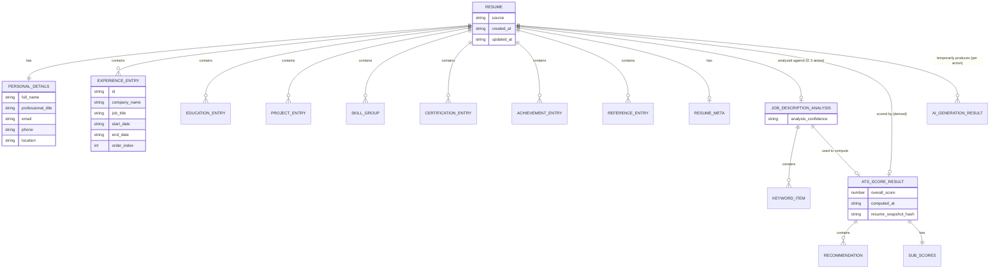

# Data Schema Document
## AI Resume Generator & ATS Resume Optimizer

**Document Version:** 1.0
**Status:** Draft for Review
**Document Owner:** Engineering
**Companion Documents:** PRD (01), TRD (02), Application Flow Document (03), Security & Data Protection Document (05)

---

## Table of Contents

1. Purpose and Scope
2. Schema Conventions
3. Resume Schema
4. Job Description Schema
5. AI Analysis Schema
6. Request Models
7. Response Models
8. Validation Rules
9. Entity Relationships
10. ER Diagram
11. Optional SQLite Schema (Ephemeral Data Only)
12. Revision History

---

## 1. Purpose and Scope

This document defines every data structure used across the application: the Resume Schema, the Job Description Schema, the AI Analysis Schema, and the JSON request/response models exposed by the API endpoints defined in the TRD (Section 9). All Pydantic models on the backend and Zod schemas on the frontend must conform exactly to the structures defined here, per the TRD's Section 20 coding standards requiring matching field names and types across both layers. Field names below are given in `snake_case`, matching the JSON wire format and backend Pydantic models; the frontend API-client boundary is responsible for any `camelCase` translation used internally by React components, per the TRD.

---

## 2. Schema Conventions

All identifiers (`id` fields) for repeatable entries (experience entries, education entries, and so on) are client-generated UUID v4 strings, created at the moment an entry is added in the builder, so that entries can be reliably reordered, edited, and deleted on the frontend before any backend round-trip occurs. All date fields are represented as ISO 8601 strings (`YYYY-MM-DD`) where a specific day is known, or `YYYY-MM` where only month/year is known (common for resume date ranges); an end date field may additionally hold the literal string `"present"` to represent ongoing roles. All text fields are UTF-8 strings with reasonable maximum length constraints (specified per field below) to prevent abuse and to keep AI prompt payloads within reasonable bounds. All schemas below are defined as the *stable* structures shared between frontend and backend; internal-only backend fields (for example, a raw-text staging field used only during parsing) are not part of this shared contract and are omitted here.

---

## 3. Resume Schema

### 3.1 `Resume` (Root Object)

| Field | Type | Required | Description |
|---|---|---|---|
| `personal_details` | `PersonalDetails` | Yes | Contact and identity information. |
| `professional_summary` | `string` (max 800 chars) | No | Free-text professional summary. |
| `experience` | `ExperienceEntry[]` | No | Ordered list of work experience entries. |
| `education` | `EducationEntry[]` | No | Ordered list of education entries. |
| `projects` | `ProjectEntry[]` | No | Ordered list of project entries. |
| `skills` | `SkillGroup[]` | No | Skills, optionally grouped by category. |
| `certifications` | `CertificationEntry[]` | No | Ordered list of certifications. |
| `achievements` | `AchievementEntry[]` | No | Ordered list of standalone achievement statements. |
| `references` | `ReferenceEntry[]` \| `ReferencesMode` | No | Either explicit reference entries or a mode flag (see 3.9). |
| `meta` | `ResumeMeta` | Yes | Non-content metadata (created/updated timestamps, source). |

### 3.2 `PersonalDetails`

| Field | Type | Required | Description |
|---|---|---|---|
| `full_name` | `string` (max 120 chars) | Yes | Full legal or preferred display name. |
| `professional_title` | `string` (max 150 chars) | No | Headline/title shown under the name. |
| `email` | `string` (email format) | No | Contact email. |
| `phone` | `string` (max 30 chars) | No | Contact phone number, any locale format. |
| `location` | `string` (max 150 chars) | No | City/region, free text. |
| `links` | `LinkEntry[]` | No | Optional list of external links. |

### 3.3 `LinkEntry`

| Field | Type | Required | Description |
|---|---|---|---|
| `label` | `string` (max 40 chars) | Yes | Display label (e.g., "LinkedIn", "Portfolio"). |
| `url` | `string` (URL format) | Yes | The link target. |

### 3.4 `ExperienceEntry`

| Field | Type | Required | Description |
|---|---|---|---|
| `id` | `string` (UUID) | Yes | Client-generated unique identifier. |
| `company_name` | `string` (max 150 chars) | Yes | Employer name. |
| `job_title` | `string` (max 150 chars) | Yes | Role/title held. |
| `location` | `string` (max 150 chars) | No | Job location, free text. |
| `start_date` | `string` (date) | Yes | Start date (YYYY-MM or YYYY-MM-DD). |
| `end_date` | `string` (date \| "present") | Yes | End date or "present". |
| `description_bullets` | `string[]` (each max 400 chars) | No | Ordered list of bullet-point descriptions. |
| `order_index` | `integer` | Yes | Display order among experience entries. |

### 3.5 `EducationEntry`

| Field | Type | Required | Description |
|---|---|---|---|
| `id` | `string` (UUID) | Yes | Client-generated unique identifier. |
| `institution_name` | `string` (max 150 chars) | Yes | School/university name. |
| `degree` | `string` (max 150 chars) | Yes | Degree/field of study. |
| `start_date` | `string` (date) | No | Start date. |
| `end_date` | `string` (date \| "present" \| "expected") | No | End/expected completion date. |
| `details` | `string` (max 300 chars) | No | GPA, honors, coursework, free text. |
| `order_index` | `integer` | Yes | Display order among education entries. |

### 3.6 `ProjectEntry`

| Field | Type | Required | Description |
|---|---|---|---|
| `id` | `string` (UUID) | Yes | Client-generated unique identifier. |
| `project_name` | `string` (max 150 chars) | Yes | Project title. |
| `link` | `string` (URL format) | No | Optional project URL. |
| `timeframe` | `string` (max 60 chars) | No | Free-text timeframe (e.g., "2023"). |
| `description_bullets` | `string[]` (each max 400 chars) | No | Ordered list of bullet-point descriptions. |
| `order_index` | `integer` | Yes | Display order among project entries. |

### 3.7 `SkillGroup`

| Field | Type | Required | Description |
|---|---|---|---|
| `category_label` | `string` (max 60 chars) | No | Category name (e.g., "Technical Skills"); omitted for an ungrouped/default list. |
| `skills` | `string[]` (each max 60 chars) | Yes | List of individual skill terms. |

### 3.8 `CertificationEntry`

| Field | Type | Required | Description |
|---|---|---|---|
| `id` | `string` (UUID) | Yes | Client-generated unique identifier. |
| `certification_name` | `string` (max 150 chars) | Yes | Certification title. |
| `issuing_organization` | `string` (max 150 chars) | No | Issuing body. |
| `date_obtained` | `string` (date) | No | Date obtained. |
| `expiration_date` | `string` (date) | No | Expiration date, if applicable. |

### 3.9 `AchievementEntry` / `ReferenceEntry` / `ReferencesMode`

`AchievementEntry` contains `id` (UUID), `statement` (string, max 300 chars), and `order_index` (integer). `ReferenceEntry` contains `id` (UUID), `name` (string, max 120 chars), `relationship` (string, max 100 chars), and `contact_info` (string, max 150 chars). `ReferencesMode` is a simple string enum with the single supported value `"available_upon_request"`, used when the user opts for the standard phrase instead of listing explicit contacts, per the Application Flow Document's References section.

### 3.10 `ResumeMeta`

| Field | Type | Required | Description |
|---|---|---|---|
| `source` | `enum("created", "uploaded")` | Yes | Whether the resume originated from the builder or from an upload/parse. |
| `created_at` | `string` (ISO 8601 datetime) | Yes | Session-local creation timestamp. |
| `updated_at` | `string` (ISO 8601 datetime) | Yes | Session-local last-update timestamp. |

---

## 4. Job Description Schema

### 4.1 `JobDescriptionInput`

| Field | Type | Required | Description |
|---|---|---|---|
| `source_type` | `enum("pasted_text", "uploaded_file")` | Yes | How the job description was provided. |
| `raw_text` | `string` (max 20,000 chars) | Conditional | Required if `source_type` is `pasted_text`, or populated post-extraction if `uploaded_file`. |
| `job_title` | `string` (max 150 chars) | No | User-supplied or extracted target job title. |
| `company_name` | `string` (max 150 chars) | No | User-supplied or extracted target company. |

### 4.2 `JobDescriptionAnalysis`

| Field | Type | Required | Description |
|---|---|---|---|
| `required_skills` | `string[]` | Yes | Skills identified as required/must-have. |
| `preferred_skills` | `string[]` | Yes | Skills identified as preferred/nice-to-have. |
| `responsibilities` | `string[]` | Yes | Key responsibilities extracted from the posting. |
| `keywords` | `KeywordItem[]` | Yes | Ranked list of notable terms for matching purposes. |
| `analysis_confidence` | `enum("high", "medium", "low")` | Yes | Overall confidence the analysis extracted meaningful, specific requirements (per the Application Flow Document's edge case for sparse job descriptions). |

### 4.3 `KeywordItem`

| Field | Type | Required | Description |
|---|---|---|---|
| `term` | `string` (max 80 chars) | Yes | The keyword or phrase. |
| `importance` | `enum("required", "preferred")` | Yes | Classification of the keyword's importance. |
| `source_context` | `string` (max 200 chars) | No | Short excerpt/context indicating where this term came from in the job description. |

---

## 5. AI Analysis Schema

### 5.1 `ATSScoreResult`

| Field | Type | Required | Description |
|---|---|---|---|
| `overall_score` | `number` (0–100) | Yes | Overall ATS compatibility estimate. |
| `sub_scores` | `SubScores` | Yes | Category-level breakdown. |
| `matched_keywords` | `string[]` | Yes | Keywords present in both resume and job description. |
| `missing_required_keywords` | `string[]` | Yes | Required keywords absent from the resume. |
| `missing_preferred_keywords` | `string[]` | Yes | Preferred keywords absent from the resume. |
| `recommendations` | `Recommendation[]` | Yes | Ordered, specific improvement recommendations. |
| `computed_at` | `string` (ISO 8601 datetime) | Yes | Timestamp the score was computed, used for staleness tracking per the TRD. |
| `resume_snapshot_hash` | `string` | Yes | Hash of the resume content at scoring time, used to detect staleness after edits. |

### 5.2 `SubScores`

| Field | Type | Required | Description |
|---|---|---|---|
| `keyword_coverage` | `number` (0–100) | Yes | Deterministically computed keyword match percentage. |
| `skills_alignment` | `number` (0–100) | Yes | AI-assessed alignment of listed skills to the role. |
| `experience_relevance` | `number` (0–100) | Yes | AI-assessed relevance of experience entries to the role. |
| `formatting_compatibility` | `number` (0–100) | Yes | Deterministically computed structural/formatting compatibility (section completeness, absence of parsing-hostile structures). |

### 5.3 `Recommendation`

| Field | Type | Required | Description |
|---|---|---|---|
| `priority` | `enum("high", "medium", "low")` | Yes | Relative importance of the recommendation. |
| `message` | `string` (max 300 chars) | Yes | Specific, actionable recommendation text. |
| `related_section` | `enum("personal_details","professional_summary","experience","education","projects","skills","certifications","achievements","references", null)` | No | Resume section the recommendation relates to, used for click-through navigation per the Application Flow Document. |

### 5.4 `AIGenerationRequest` / `AIGenerationResult`

`AIGenerationRequest` contains `action_type` (enum: `generate_summary`, `rewrite_summary`, `rewrite_experience_bullets`, `rewrite_project_description`, `suggest_achievement_phrasing`), `source_content` (the current field content being improved — string or string array depending on action type), and an optional `job_description_analysis` (the `JobDescriptionAnalysis` object, when tailoring is desired). `AIGenerationResult` contains `generated_content` (same shape as `source_content`), `guardrail_validated` (boolean indicating the post-generation entity-preservation check passed), and `warning_message` (nullable string, populated if generation succeeded but with a lower-confidence guardrail pass requiring user attention).

---

## 6. Request Models

`POST /api/v1/resume/parse` — multipart form body containing a single `file` field (PDF or DOCX binary).

`POST /api/v1/resume/validate` — JSON body: `{ "resume": Resume }`.

`POST /api/v1/job-description/analyze` — JSON body: `{ "input": JobDescriptionInput }` (for pasted text) or multipart form body containing `file` plus optional `job_title`/`company_name` fields (for uploaded job descriptions).

`POST /api/v1/ai/generate` — JSON body: `{ "request": AIGenerationRequest }`.

`POST /api/v1/analysis/score` — JSON body: `{ "resume": Resume, "job_description_analysis": JobDescriptionAnalysis }`.

`POST /api/v1/export/pdf` and `POST /api/v1/export/docx` — JSON body: `{ "resume": Resume, "template_id": string }`.

---

## 7. Response Models

`ParsedResumeResult` — `{ "resume": Resume, "section_confidence": { [section_name: string]: enum("high","needs_review","not_found") } }`.

`ResumeValidationResult` — `{ "is_export_ready": boolean, "missing_required_fields": string[] }`.

`JobDescriptionAnalysisResponse` — the `JobDescriptionAnalysis` object directly (Section 4.2).

`AIGenerationResponse` — the `AIGenerationResult` object directly (Section 5.4).

`ATSScoreResponse` — the `ATSScoreResult` object directly (Section 5.1).

Export endpoints return a raw binary file stream (`application/pdf` or `application/vnd.openxmlformats-officedocument.wordprocessingml.document`) with a `Content-Disposition: attachment; filename="{full_name}_Resume.{ext}"` header, rather than a JSON envelope.

All error responses across all endpoints use the shared error envelope defined in the TRD (Section 9): `{ "error": { "code": string, "message": string, "details": object | null } }`.

---

## 8. Validation Rules

`personal_details.full_name` must be non-empty and is the single hard-blocking field for the `ResumeValidationResult.is_export_ready` flag, per the PRD's business rules; in addition, at least one of `experience`, `education`, or `projects` must contain at least one entry for `is_export_ready` to be true. `personal_details.email`, when provided, must match a standard email format; invalid values are rejected at the field level with an inline error rather than blocking the entire form. Date fields must parse as valid ISO 8601 dates (year-month or full date); `end_date` fields additionally accept the literal `"present"` for `ExperienceEntry` and `"present"`/`"expected"` for `EducationEntry`. Uploaded files for both resume parsing and job description analysis are validated against an allow-list of MIME types (`application/pdf`, `application/vnd.openxmlformats-officedocument.wordprocessingml.document` for DOCX, and additionally `text/plain` for job description uploads) and against the configured `MAX_UPLOAD_SIZE_MB` environment variable (per the TRD, Section 21); files failing either check are rejected with HTTP 415 or 413 respectively, before any parsing logic executes. All AI-facing JSON generation (job description analysis, AI generation results, ATS scoring) is validated against its corresponding Pydantic model immediately upon receipt from the Groq API; a response that fails to parse or fails required-field validation is treated as an AI error per the TRD's Section 17 error-handling strategy, never passed through partially populated or malformed.

---

## 9. Entity Relationships

A single `Resume` object owns zero-or-more `ExperienceEntry`, `EducationEntry`, `ProjectEntry`, `CertificationEntry`, `AchievementEntry`, and `ReferenceEntry` records, each existing only in the context of that resume (no entry is shared across resumes, consistent with the session-scoped, no-persistent-storage design). A `Resume` optionally relates to zero-or-one active `JobDescriptionAnalysis` at a time within a session (the currently active target job), though a user may, per the Application Flow Document's Alternative User Paths, analyze the same resume against several job descriptions sequentially — each such analysis producing its own independent `JobDescriptionAnalysis` and, in turn, its own `ATSScoreResult`, without the system needing to retain more than the currently active one at any moment. An `ATSScoreResult` is derived from exactly one `Resume` snapshot and exactly one `JobDescriptionAnalysis`, and is considered stale (per its `resume_snapshot_hash`) the moment the source resume changes. An `AIGenerationResult` relates to exactly one resume section/entry at the moment it is generated and, upon user acceptance, its `generated_content` is written back into that specific field of the `Resume` object, after which the `AIGenerationResult` itself is discarded (not persisted as a separate entity).

---

## 10. ER Diagram



---

## 11. Optional SQLite Schema (Ephemeral Data Only)

As stated in the TRD (Section 7), SQLite is optional infrastructure and, if used, is scoped strictly to ephemeral, non-personal operational data — it must never store resume content, job description content, or any personally identifiable information, consistent with the product's no-login, no-persistent-storage design and the Security & Data Protection Document. A permissible example schema, if rate-limiting persistence across backend instances is required, is shown below; note the complete absence of any user-content columns.

```sql
CREATE TABLE IF NOT EXISTS rate_limit_counters (
    id INTEGER PRIMARY KEY AUTOINCREMENT,
    client_identifier TEXT NOT NULL,      -- hashed IP or request-scoped token, not user content
    window_start_at TEXT NOT NULL,        -- ISO 8601 datetime
    request_count INTEGER NOT NULL DEFAULT 0,
    UNIQUE (client_identifier, window_start_at)
);
```

No table for resumes, job descriptions, AI generation results, or ATS scores is defined, by design; all such data lives exclusively in-memory for the duration of request processing and in the frontend's session-scoped Zustand stores, per the TRD's architecture.

---

## 12. Revision History

| Version | Date | Author | Description |
|---|---|---|---|
| 1.0 | Initial Draft | Engineering | Initial creation of the Data Schema Document covering the Resume Schema, Job Description Schema, AI Analysis Schema, request/response models, validation rules, and entity relationships. |

---

*End of Data Schema Document. Proceeding to the Security & Data Protection Document.*
